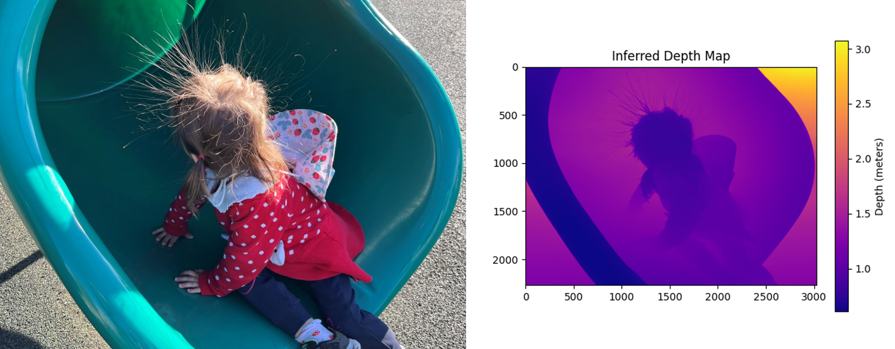
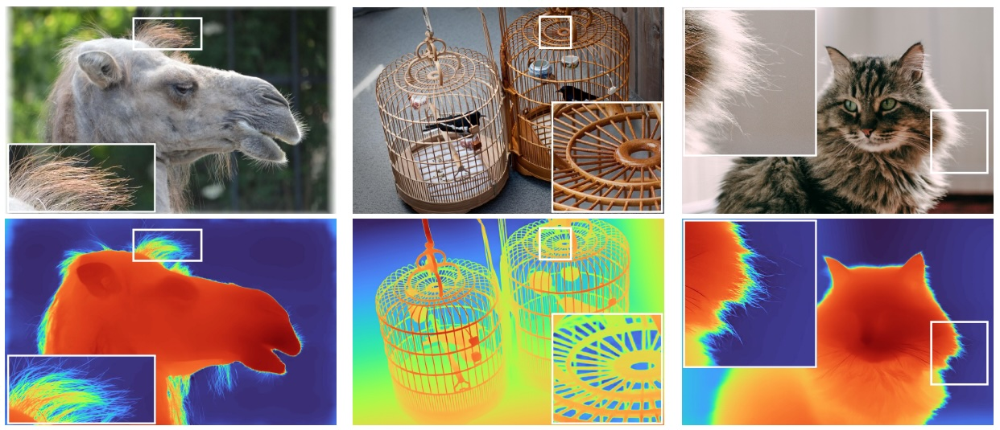

## Getting Started
Note: The current depth estimation model requires significant GPU resources, and the camera FPS may be reduced. 
We recommend setting up a virtual environment. Using e.g. Anaconda run as administration, the `depth_pro` package can be installed via:

```bash
cd /target/folder
conda create -n depth-pro-win-gpu -y python=3.9
conda activate depth-pro-win-gpu
```
Install PyTorch with CUDA for GPU based computing. The example below is for CUDA 11.8:  
CUDA Installation: https://developer.nvidia.com/cuda-11-8-0-download-archive  
PyTorch Installation: https://pytorch.org/, example 

```bash
conda install pytorch torchvision torchaudio pytorch-cuda=11.8 -c pytorch -c nvidia
git clone https://github.com/lattebyte/DepthPro-Windows-GPU.git
cd DepthPro-Windows-GPU
pip install -e .
pip install opencv-python
```

To download pretrained checkpoints follow the steps below:
```bash
# create directory
mkdir checkpoints
```
Then, manually download model by entering the following into web browser:
`https://huggingface.co/lattebyte-ai/Depth_Est/blob/main/depth_pro.pt`

Once completed, move `depth_pro.pt` into `checkpoints`


### Running from python
LICENSE_2 applies to `gpu_depth_inference.py`, `lattebyte_cm16a_camera.py`, `depthpro_gpu_setting.py`
```bash
python gpu_depth_inference.py
```

## Original References
### Depth Pro: Sharp Monocular Metric Depth in Less Than a Second

This software project accompanies the research paper:
**[Depth Pro: Sharp Monocular Metric Depth in Less Than a Second](https://arxiv.org/abs/2410.02073)**, 
*Aleksei Bochkovskii, Amaël Delaunoy, Hugo Germain, Marcel Santos, Yichao Zhou, Stephan R. Richter, and Vladlen Koltun*.

We present a foundation model for zero-shot metric monocular depth estimation. Our model, Depth Pro, synthesizes high-resolution depth maps with unparalleled sharpness and high-frequency details. The predictions are metric, with absolute scale, without relying on the availability of metadata such as camera intrinsics. And the model is fast, producing a 2.25-megapixel depth map in 0.3 seconds on a standard GPU. These characteristics are enabled by a number of technical contributions, including an efficient multi-scale vision transformer for dense prediction, a training protocol that combines real and synthetic datasets to achieve high metric accuracy alongside fine boundary tracing, dedicated evaluation metrics for boundary accuracy in estimated depth maps, and state-of-the-art focal length estimation from a single image.


The model in this repository is a reference implementation, which has been re-trained. Its performance is close to the model reported in the paper but does not match it exactly.


### Depth Pro: Sharp Monocular Metric Depth in Less Than a Second

This software project accompanies the research paper:
**[Depth Pro: Sharp Monocular Metric Depth in Less Than a Second](https://arxiv.org/abs/2410.02073)**, 
*Aleksei Bochkovskii, Amaël Delaunoy, Hugo Germain, Marcel Santos, Yichao Zhou, Stephan R. Richter, and Vladlen Koltun*.

We present a foundation model for zero-shot metric monocular depth estimation. Our model, Depth Pro, synthesizes high-resolution depth maps with unparalleled sharpness and high-frequency details. The predictions are metric, with absolute scale, without relying on the availability of metadata such as camera intrinsics. And the model is fast, producing a 2.25-megapixel depth map in 0.3 seconds on a standard GPU. These characteristics are enabled by a number of technical contributions, including an efficient multi-scale vision transformer for dense prediction, a training protocol that combines real and synthetic datasets to achieve high metric accuracy alongside fine boundary tracing, dedicated evaluation metrics for boundary accuracy in estimated depth maps, and state-of-the-art focal length estimation from a single image.


The model in this repository is a reference implementation, which has been re-trained. Its performance is close to the model reported in the paper but does not match it exactly.
### Citation

If you find our work useful, please cite the following paper:

```bibtex
@article{Bochkovskii2024:arxiv,
  author     = {Aleksei Bochkovskii and Ama\"{e}l Delaunoy and Hugo Germain and Marcel Santos and
               Yichao Zhou and Stephan R. Richter and Vladlen Koltun}
  title      = {Depth Pro: Sharp Monocular Metric Depth in Less Than a Second},
  journal    = {arXiv},
  year       = {2024},
  url        = {https://arxiv.org/abs/2410.02073},
}
```

### License
This sample code is released under the [LICENSE](LICENSE) terms.

The model weights are released under the [LICENSE](LICENSE) terms.

### Acknowledgements

Our codebase is built using multiple opensource contributions, please see [Acknowledgements](ACKNOWLEDGEMENTS.md) for more details.

Please check the paper for a complete list of references and datasets used in this work.